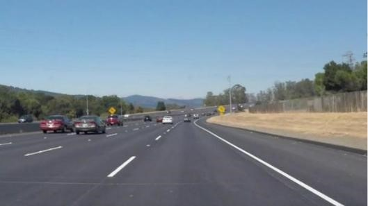
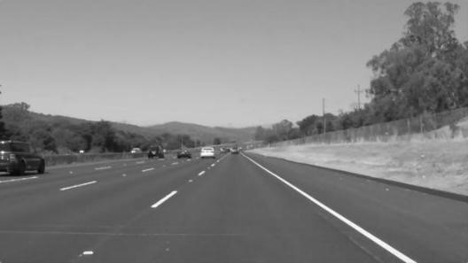
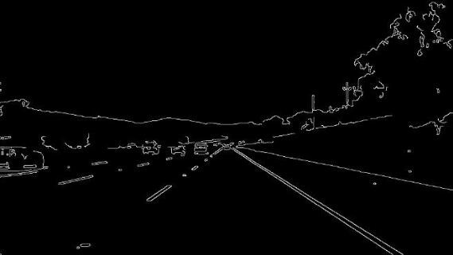
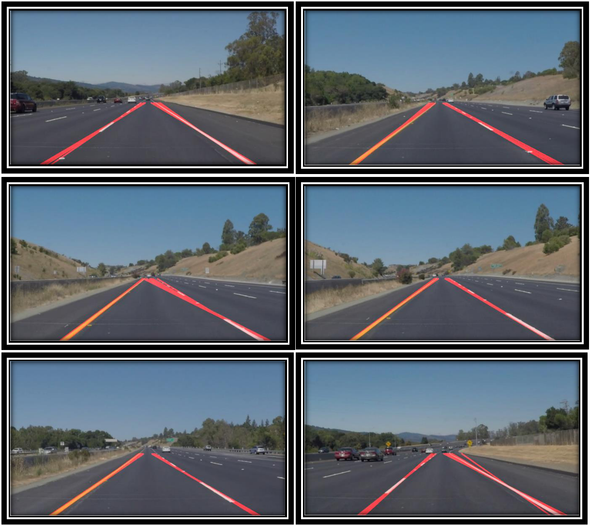

# Finding Lane Lines on the Road

In my project I used python 3 and OpenCV to find lane lines on roads in images as well as on video clips.

**The following techniques were utilized:**

```
1) Converting the images into grayscale.
2) Applying Gaussian Blur
3) Finding edges using canny edge detection (openCV)
4) Specifying ROI.
5) Hough Transform for line detection
```
### Building A Pipeline:

The images are first read using the imread function.


They are then converted into gray scale images from RGB model.


The image is then blurred using gaussian blur with kernel size 3


Canny edge detector is then run through images to find all the available edges in the image:



The edge detection is then limited to the region of interest specified. And then masked with the original
image to get the test_images_output.

Following are the images that I got.



### IMPROVED LANE FINDING PIPELINE:

### Modifications to the draw_lines() function:

All the lines detected by the hough transform with slope >0 were grouped together and appended
one by one. Similarly lines obtained with slope< 0 were grouped together. An average x1, y1, x2, y
were then found out. Followed by computing right slope and left slope. The y1 and y2 were then
limited as per the size of the image. Y1 was restricted to img.shape[ 0 ] and 60% of that image soze
was used for y2. Which was then utilized to calculate x1 and x2 using a simple line equation Y=mx+C
as we have two equations and two variable, solving the two equations gives us x1 and x2.

The pipeline was tested on two videos in the test_videos_output folder.

## REFLECTION

### 1. Potential shortcomings with current pipeline

I can see that the red lines obtained using Hough transform clash at some image points and are
detected wrongfully at some points. It isn’t stable and requires some extent of stabilization.

This can be improved by tuning the slope characterization from the lines obtained via Hough
transform.

Also my pipe lines takes a lot of time which cannot be adapted to a real life scenario in a
autonomous car.

### 2. Possible improvements to the pipeline

A more proper efficient and robust method needs to be developed. One possible area where I can
dig deeper is to explore color space to detect yellow and white lines proper.

In order to stabilize the detected lane lines a researching more on the algorithm for left and right
lane line detection will help.


